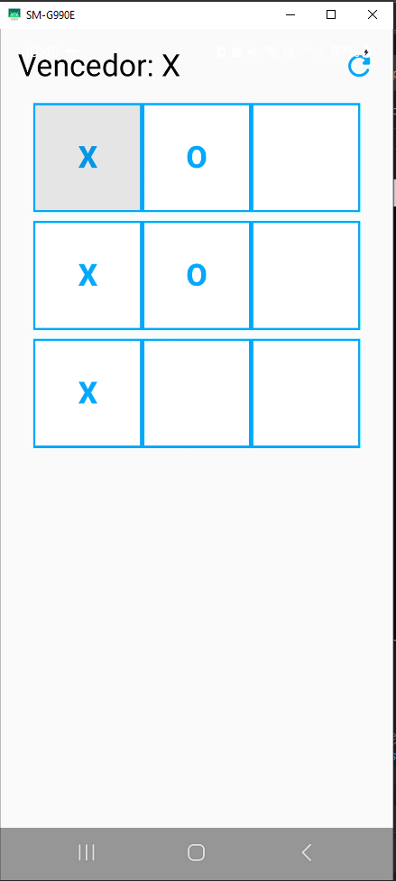
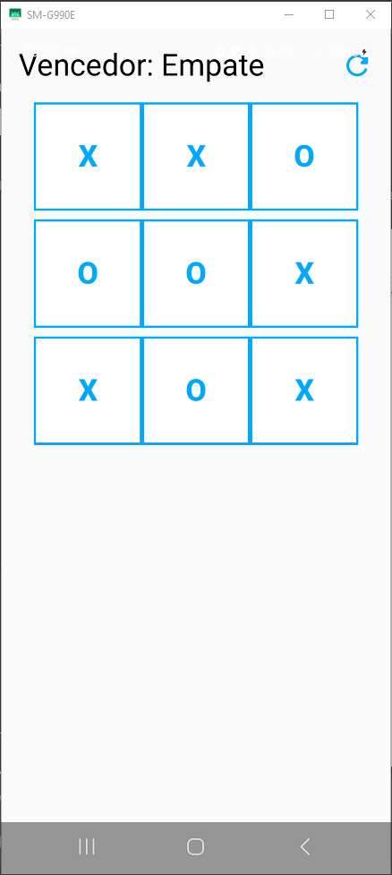

# 🎮 Jogo da Velha - Android Studio com Jetpack Compose

Projeto desenvolvido como parte da disciplina **Programação para Dispositivos Móveis** no curso de **Análise e Desenvolvimento de Sistemas (ADS)** do **IFTM - 6º Período**.  
Nesta aplicação, foi implementado o clássico **Jogo da Velha (Tic-Tac-Toe)** com interface 100% em **Jetpack Compose** e lógica desenvolvida em **Kotlin**.

---

## 🧠 Descrição da Atividade

Nesta atividade, o objetivo foi criar um jogo interativo onde dois jogadores pudessem se alternar jogando "X" e "O". O sistema deve identificar automaticamente o **vencedor**, **empate** e permitir **reiniciar o jogo** com um clique.

**Requisitos:**
- Grade 3x3 representando o tabuleiro
- Identificação de vitória (linhas, colunas e diagonais)
- Exibição do status do jogo: jogador da vez, vencedor ou empate
- Botão de reiniciar partida
- Impedir jogadas repetidas
- Estilização de botões e layout

---

## ✅ Funcionalidades Implementadas

- 🔁 Alternância entre jogadores "X" e "O"
- 🏆 Detecção de vitória
- ⚖️ Detecção de empate
- 🚫 Impede que uma célula já preenchida seja usada novamente
- 🔄 Botão "Reiniciar"
- 🎨 Estilo personalizado com cores e espaçamentos

---

## 🧪 Prints da Aplicação

### 🏆 Vencedor X


### ⚖️ Empate


---

## 📚 Tecnologias e Ferramentas

- Android Studio
- Kotlin
- Jetpack Compose
- Material 3
- Composable Functions
- Mutable States com `remember`

---

## 🎓 Informações Acadêmicas

- 📘 **Disciplina:** Programação para Dispositivos Móveis  
- 🧑‍🎓 **Curso:** Análise e Desenvolvimento de Sistemas  
- 🏫 **Instituição:** IFTM - Instituto Federal do Triângulo Mineiro  
- 📆 **Período:** 6º Período  

---

## 🙏 Créditos

A lógica e estrutura visual foram baseadas nos ensinamentos do canal  
👉 [Stack Mobile no YouTube](https://www.youtube.com/@StackMobile), com adaptações feitas para atender às exigências da atividade e preferências de layout.

---

## 🚀 Como Executar o Projeto

1. Clone este repositório:
```bash
git clone https://github.com/seu-usuario/jogo-da-velha.git
